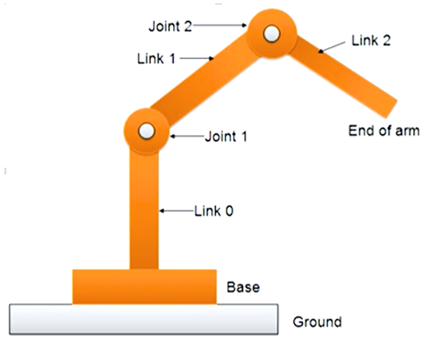
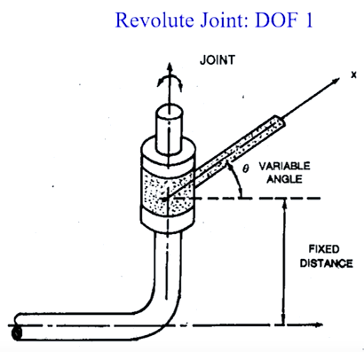
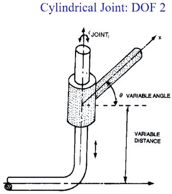
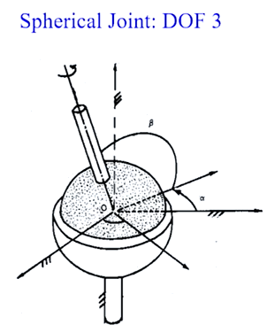
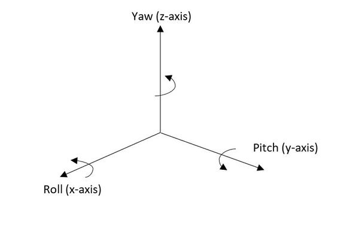
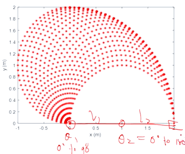
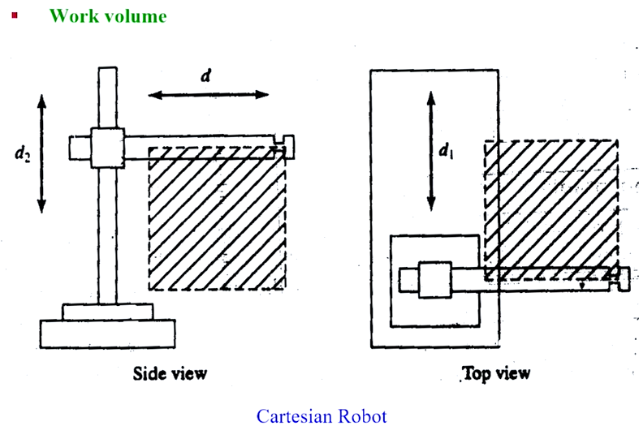

Robotics system is composed of:

1. Links
2. Joints
3. Sensors
4. Actuators

Links:
Links exist between joints. Links can be rigid or flexible.
Examples: Humanoid robots - straight rigid / serial links. Hexoskeleton - series of mechanisms.

Joints:
Example: Medical robotics - prismatic joint (slide along a single axis).
Types of Joints:

1. Revolute Joint:

DOF 1.
q=[θ,d] //q - joint variable. θ - variable for rotational variable angle. d - variable for prismatic joint.

2. Cylindrical Joint:

DOF 2.
q=[θ,d] //d - variable distance from origin.

3. Spherical Joint.

DOF 3 = Roll (x), Pitch (y), Yaw (z).

End Effector:
The special toolong for a robot that enables it to perform a special task.
A device attached to the robot's wrist to perform a specific task.
Two types:
1. Gripper:
To grasp and manipulate objects during work cycle.
2. Tools:
To perform a process, e.g., welding, painting.

Work volume:
Volume inside which the robot can position its gripper. 
The job to be performed must be inside the work volume.
1. Example: 2 Revolute Jointed Planar Robot Work Volume

θ1 = 90∘ Joint 1, θ2 = 180∘ Joint 2. Thus 2 DOF.
2. Example 2: Cartesian Robot:
The joints of the Cartesian robot are made of Prismatic joints. Variation is just 'd'.
